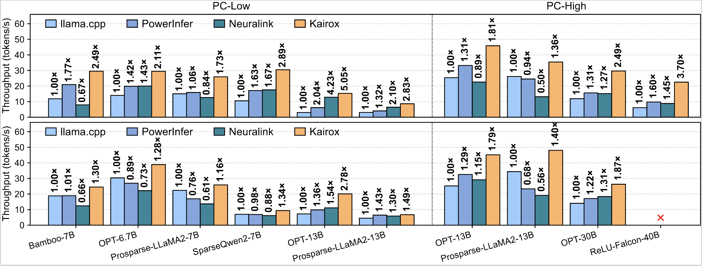

# SparkInfer

Fastest local LLM inference by activation sparsity

## Demo Video
https://private-user-images.githubusercontent.com/156072106/538753529-58e49e15-4544-4fa1-a691-1b5bf61a6cda.mp4?jwt=eyJ0eXAiOiJKV1QiLCJhbGciOiJIUzI1NiJ9.eyJpc3MiOiJnaXRodWIuY29tIiwiYXVkIjoicmF3LmdpdGh1YnVzZXJjb250ZW50LmNvbSIsImtleSI6ImtleTUiLCJleHAiOjE3NjkwMjU1NDAsIm5iZiI6MTc2OTAyNTI0MCwicGF0aCI6Ii8xNTYwNzIxMDYvNTM4NzUzNTI5LTU4ZTQ5ZTE1LTQ1NDQtNGZhMS1hNjkxLTFiNWJmNjFhNmNkYS5tcDQ_WC1BbXotQWxnb3JpdGhtPUFXUzQtSE1BQy1TSEEyNTYmWC1BbXotQ3JlZGVudGlhbD1BS0lBVkNPRFlMU0E1M1BRSzRaQSUyRjIwMjYwMTIxJTJGdXMtZWFzdC0xJTJGczMlMkZhd3M0X3JlcXVlc3QmWC1BbXotRGF0ZT0yMDI2MDEyMVQxOTU0MDBaJlgtQW16LUV4cGlyZXM9MzAwJlgtQW16LVNpZ25hdHVyZT03NTM3OTQ4NmZiMTRmMzdlNGQ5Nzc4MjBjNGUzYzJlMGM0ZDkxYWIwZTJlOGNjMjhmNWFjYWM1Y2ZhYTAxZmFhJlgtQW16LVNpZ25lZEhlYWRlcnM9aG9zdCJ9.SEpkkW4x7cJU1VV2WEmTj1z8CeUDh2GlcyrBp3t2Agw

SparkInfer v.s. PowerInfer on a single RTX 4090(24GB) running ProSparse-Llama-2-13B FP16(26GB) with 2 times speedup!

## Abstract
We present SparkInfer, an adaptive GPU–CPU hybrid inference system that addresses these limitations through online neuron balancing, a mechanism that dynamically redistributes neurons between the GPU and CPU based on activation behaviors. Extensive evaluations on consumer-grade PCs demonstrate that SparkInfer improves end-to-end throughput by up to 5.05×, 2.48×, and 3.71× over llama.cpp, PowerInfer, and Neuralink, respectively.


## Models Weights
### Supported Models
// TODO
### Download Models
// TODO


## Getting Started with SparkInfer

### Compilation Instructions
To compile SparkInfer, follow these steps:
```bash
cmake -B build -DCMAKE_BUILD_TYPE=Release \
    -DGGML_CUDA=ON \
    -DBUILD_SHARED_LIBS=OFF \
    -DGGML_CUDA_GRAPHS=OFF
cmake --build build --config Release -j"$(nproc)" --target llama-cli
```

**Optional Compilation Speed-Up**: You can specify `-DCMAKE_CUDA_ARCHITECTURES=""` to reduce compilation time by targeting only your NVIDIA GPU architecture. Replace the value with the appropriate architecture for your GPU. For example:
- For RTX 4090: `-DCMAKE_CUDA_ARCHITECTURES="89-real"`

### Running a Demo
1. Update the model path (and model-split path) and configure the desired hardware settings in `run_demo.sh`.
2. Execute the demo script:
```bash
bash run_demo.sh
```


## Evaluation
We evaluated SparkInfer against llama.cpp, PowerInfer, and Neuralink on two PC configurations: **PC-Low** (NVIDIA RTX 3080Ti, 12GB) and **PC-High** (NVIDIA RTX 4090, 24GB). The results below demonstrate that SparkInfer achieves significant performance improvements, with up to **5.05× speedup** over llama.cpp, **3.71×** over Neuralink, and **2.48×** over PowerInfer.



More details could be find in our paper.

## Paper and Citation
// TODO
